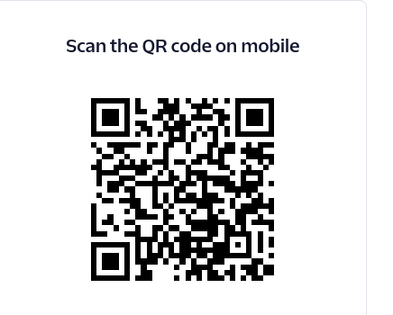

# Sebenza - Career Guidance Bot

Sebenza is an innovative career guidance chatbot designed to assist unemployed youth in navigating their career journey. The bot provides tailored advice on potential career paths based on the user's skills and interests, helps revamp or generate a CV, offers interview preparation, and connects users with industry mentors for further guidance and support.

## Scan to Interact

You can easily start a conversation with Sebenza by scanning the QR code below:

## Table of Contents

* 1. Features
* 2. Getting Started
* 3. Installation
* 4. Usage
* 5. Tech Stack
* 6. API Endpoints
* 7. Database Schema
* 8. Mentor Network
* 9. Contribution
* 10. License

## Features

* **Career Guidance**: Offers tailored career paths based on the user's qualifications, interests, and skills.
* **CV Generation and Revamp**: Helps users create a new CV or improve an existing one.
* **Interview Preparation**: Provides practice questions and tips for acing interviews tailored to the desired role.
* **Mentor Connection**: Connects users with industry mentors who offer apprenticeships or shadowing opportunities to gain industry-relevant experience.
* **WhatsApp Integration**: Users can interact with Sebenza through WhatsApp, making it accessible and user-friendly.

## Getting Started

To get started with Sebenza, scan the QR code above to initiate a conversation on WhatsApp. Sebenza will guide you through providing your qualifications, interests, and skills, and will suggest career paths tailored to your profile.

## Installation

To run the Sebenza project locally, follow these steps:

* **Clone the repository**:

git clone https://github.com/your-username/sebenza.git cd sebenza

* **Create a virtual environment and activate it**:

python -m venv myvenv source myvenv/bin/activate

* **Install the necessary dependencies**:

pip install -r requirements.txt

* **Run the server**:

* **If port 5000 is already in use, you can specify a different port**:

flask run --port 5001

## Usage

* **Start a conversation**: Initiate a chat with Sebenza by scanning the QR code or adding Sebenza's contact on WhatsApp.
* **Provide your information**: Follow the guided conversation to share your qualifications, skills, and interests.
* **Get Career Advice**: Sebenza will suggest career paths, connect you with mentors, and help with CV generation or revamp.
* **Request a Mentor**: Once you've decided on a career path, request to be connected with a mentor for further guidance.

## Tech Stack

* **Frontend**: Next.js
* **Backend**: Flask, Python
* **Database**: MongoDB
* **Messaging Platform**: WhatsApp API integration

## API Endpoints

* **POST /api/user**: Register a new user and capture their information.
* **GET /api/career-paths**: Get suggested career paths based on user profile.
* **POST /api/mentor-connect**: Request to connect with a mentor.
* **POST /api/cv-generate**: Generate or revamp a user's CV.

## Database Schema

* **User Collection**
* userId: String (Unique identifier)
* name: String
* email: String
* phone: String
* skills: Array of Strings
* interests: Array of Strings
* education: Array of Objects (degree, institution, year)

* **Mentor Collection**
* mentorId: String (Unique identifier)
* name: String
* email: String
* phone: String
* specialization: String
* experience: String
* availability: Boolean

## Mentor Network

Sebenza has a network of mentors willing to support unemployed youth by offering apprenticeships or shadowing opportunities in various fields, including technical and non-technical roles, such as:

* **Technical Roles**: Software Developer, Data Analyst, Digital Marketer
* **Non-Technical Roles**: Sales, Customer Support, Content Writer
* **Trades**: Electrician, Plumber, Carpenter, Mechanic

## Contribution

We welcome contributions from the community to make Sebenza even better. To contribute:

* Fork the repository.
* Create a feature branch (git checkout -b feature/new-feature).
* Commit your changes (git commit -m 'Add new feature').
* Push to the branch (git push origin feature/new-feature).
* Open a Pull Request.

## License

This project is licensed under the MIT License - see the LICENSE file for details.

